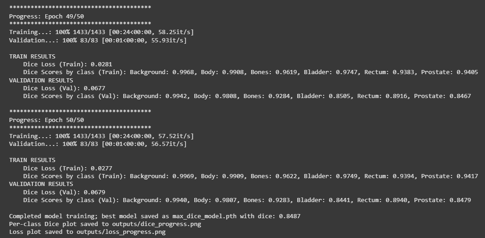
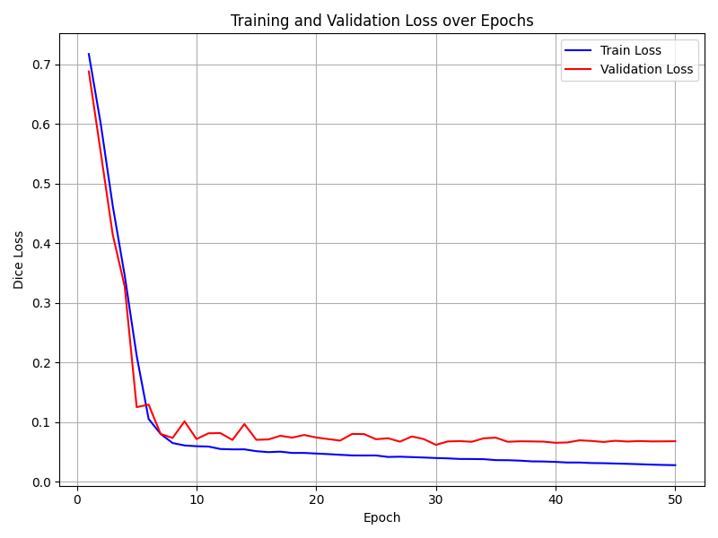
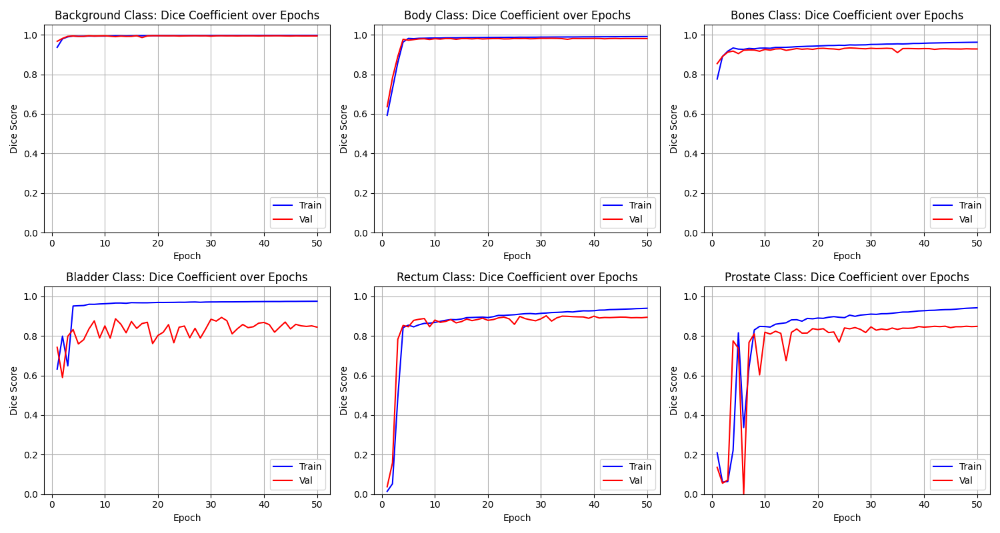
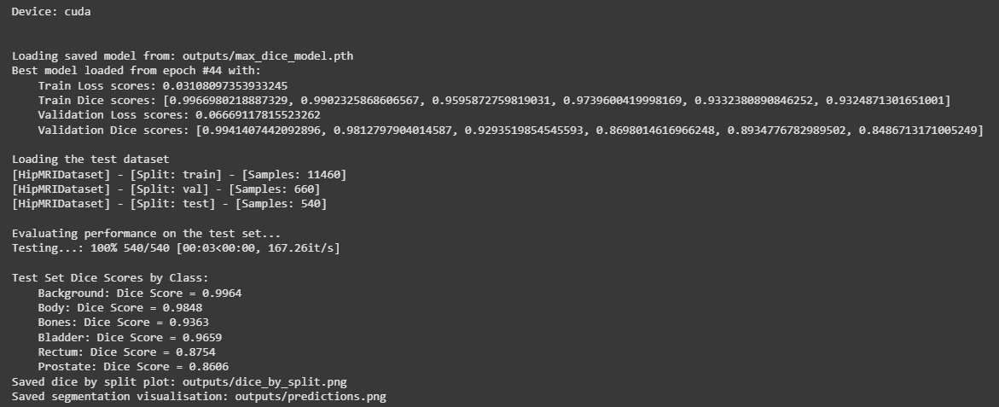
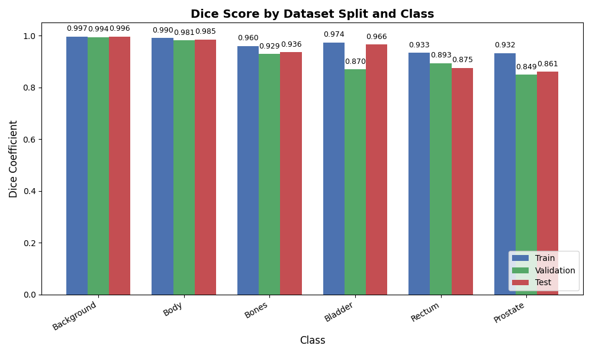
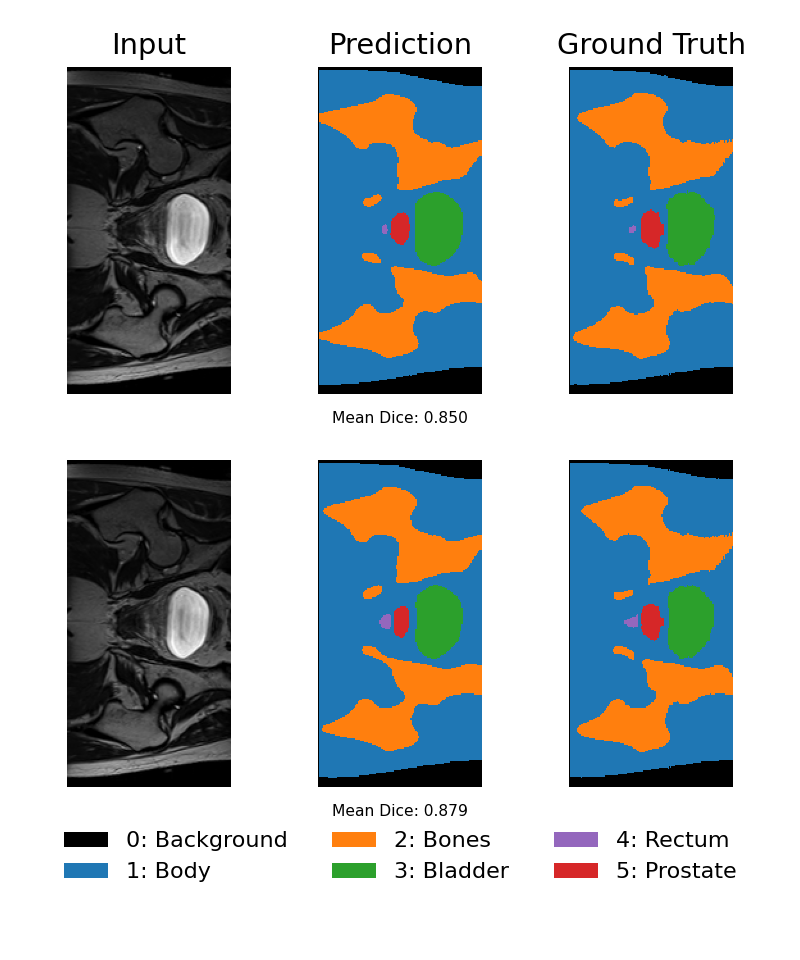

# HipMRI 2D Segmentation with a Basic U-Net
- Author: William Wright
- Student No.: 46935436
- Course: COMP3710
- Semester: 2
- Year: 2025

**Note**: the language of 'Dice score' and 'Dice coefficient' may be used interchangeably, but both refer to the [Dice-Sørensen coefficient](https://en.wikipedia.org/wiki/Dice-S%C3%B8rensen_coefficient). 

## Overview
This project performs 2D segmentation of the HipMRI dataset to segment the following classes: 
- 0 = Background
- 1 = Body
- 2 = Bones
- 3 = Bladder 
- 4 = Rectum
- 5 = Prostate,

as outlined in the `BriefDataDescription.txt`, with the original dataset is found [here](https://data.csiro.au/collection/csiro:51392v2?redirected=true).

The algorithm is a PyTorch implementation of a U-Net-style encoder–decoder with skip connections and a multi-class Dice loss function. This targets strong performance on the prostate class while maintaining balanced accuracy across all classes. It helps to solve the problem of manual segmentation by humans by providing a reasonably accurate segmentation through a neural network model.

## How it works
The MRI images and corresponding labels are loaded from Nifti (`.nii.gz`) files, which are then resized to a consistent image size, and fed as single-channel inputs to a 2D U-Net. The network has contracting path (downsampling via max-pooling) and an expansive path (upsampling plus skip connections), producing per-pixel class logits. Training uses a custom defined multi-class Dice loss computed on softmax probabilities against one-hot encoded labels, which directly optimise the 'overlap quality' for imbalanced classes. A learning rate scheduler is also implemented, which combines a short linear warm-up with a polynomial decay. We store the per-class Dice scores on the train and validation datasets at each epoch. Models are saved/overwritten when the "minimum Dice score across all six classes" is improved from the previous save. We repeat the same on the test set by reporting the per-class Dice scores and produce accompanying visualisations. You can find a background paper on the topic [here](https://arxiv.org/abs/1505.04597).

## Model Architecture
This project uses a basic 2D U-Net defined in `modules.py` with standard `DoubleConv` blocks (Conv3x3 -> BatchNorm2d -> ReLU) and skip connections. 

### Building Blocks

- DoubleConv(in_ch, out_ch)  
  `Conv2d() -> BatchNorm2d() -> ReLU() -> Conv2d(k=3, pad=1) -> BatchNorm2d() -> ReLU()`  
  Purpose: feature extraction & refinement at each resolution.

- Down(in_ch, out_ch)  
  `MaxPool2d() -> DoubleConv()`  
  Purpose: halve H,W and double channels to capture larger context.

- Up(in_ch, out_ch, bilinear=True)  
  If `bilinear=True`: `Upsample(scale=2, mode="bilinear")`  
  Else: `ConvTranspose2d(k=2, stride=2)`  
  Then: concatenate with encoder skip, followed by `DoubleConv()`  
  Note: any spatial (image dimension) mismatch is fixed with `F.interpolate(..., mode="bilinear")` before concat.

- OutConv(in_ch, out_ch)  
  `Conv2d(k=1)`  
  Purpose: map final decoder features to per-pixel class logits.

### Encoder -> Bottleneck -> Decoder

Input (B, 1, 256, 128) and `bf = 32`:

- Encoder
  - `inc`: DoubleConv(1 -> 32) -> (B, 32, 256, 128) (skip-1)
  - `down1`: MaxPool -> DoubleConv(32 -> 64) -> (B, 64, 128, 64) (skip-2)
  - `down2`: MaxPool -> DoubleConv(64 -> 128) -> (B, 128, 64, 32) (skip-3)
  - `down3`: MaxPool -> DoubleConv(128 -> 256) -> (B, 256, 32, 16) (skip-4)

- Bottleneck
  - `down4`: MaxPool -> DoubleConv(256 -> 256) -> (B, 256, 16, 8)

- Decoder
  - `up1`: Upsample 256 -> concat with skip-4 (256) -> DoubleConv(512 -> 128) -> (B, 128, 32, 16)
  - `up2`: Upsample 128 -> concat with skip-3 (128) -> DoubleConv(256 -> 64) -> (B, 64, 64, 32)
  - `up3`: Upsample 64 -> concat with skip-2 (64) -> DoubleConv(128 -> 32) -> (B, 32, 128, 64)
  - `up4`: Upsample 32 -> concat with skip-1 (32) -> DoubleConv(64 -> 32) -> (B, 32, 256, 128)

- Head
  - `outc`: Conv1×1(32 -> 6) -> logits (B, 6, 256, 128)

### Loss Function (Multi-class Dice)

`MCDiceLoss()` computes the Dice score on softmax probabilities against one-hot labels, per class and averages across batch & classes:

$$\text{Dice}_c = \frac{2\sum_{i} p_{ic} t_{ic} + \varepsilon}{\sum_{i} p_{ic} + \sum_{i} t_{ic} + \varepsilon}, \quad
\mathcal{L}_{\text{Dice}} = 1 - \frac{1}{C}\sum_{c=1}^C \text{Dice}_c$$

- `probs = softmax(logits, dim=1)`  
- `tgt_oh = one_hot(target).movedim(-1, 1)` to shape (B, C, H, W)  
- Optional `class_weights` can weight Dice per class before averaging.  
- `eps` (default 1.0) smooths numerator/denominator (for numerical stability and convergence, as in COSC2500)

### Notes/Reasoning

- Bilinear upsampling helps to smoothly make the image larger and keep the number of feature channels lined up correctly for each layer. 
- Automatic size matching: before combining the upsampled image with its matching encoder features, the code resizes it so both have exactly the same height and width.
- No final activation: the training function provided uses logits directly (softmax happens inside the Dice loss), so inference should apply `softmax` (for probabilities) or `argmax` (for hard masks).

### Summary Table
| **Component**        | **Details** |
|----------------------|-------------|
| **Input Size**       | 1 x 256 x 128 (single-channel 2D MRI slice) |
| **Output Size**      | 6 x 256 x 128 (per-pixel logits for 6 classes) |
| **Encoder Levels**   | 4 (each level uses MaxPool2d to downsample) |
| **Decoder Levels**   | 4 (each level upsamples and concatenates with encoder features) |
| **Base Features**    | 32 filters |
| **Feature Progression** | 32 -> 64 -> 128 -> 256 (constant bottleneck) |
| **Normalisation**    | Batch Normalisation after every Conv2d |
| **Activation**       | ReLU |
| **Upsampling Mode**  | Bilinear interpolation |
| **Output Activation**| None (logits with softmax) |

## File/Repository Structure
    # Inside `HipMRI - 2D UNet - s4693543` folder

        # GitHub Repo
    ├── dataset.py      # Handles dataset loading, preprocessing, and DataLoader
    ├── modules.py      # Basic 2D U-Net architecture and Dice loss function
    ├── train.py        # Training script
    ├── predict.py      # Evaluation and visualisation on test set

    ├── data/           # Dataset -> saved locally or Rangpur path
    │ ├── keras_slices_seg_test
    │ ├── keras_slices_seg_train
    │ ├── keras_slices_seg_validate
    │ ├── keras_slices_test
    │ ├── keras_slices_train
    │ └── keras_slices_validate

        # NOT on the Github Repo
    ├── outputs/        # Folder for saved models/plots
    │ ├── max_dice_model.pth
    │ ├── dice_progress.png
    │ ├── loss_progress.png
    │ ├── dice_by_split.png
    │ └── predictions.png

## Dataset/Splits
The dataset provided contains train/validate/test splits already, hence no further splitting was required. These help in the model training and evaluation process by avoiding data leakage and to give a fair comparison/baseline across different models tested on the same dataset. 

**Dataset Statistics:**  
- Training: 11,460 slices  
- Validation: 660 slices  
- Test: 540 slices  
- Resolution: 256 x 128  
- Classes: 6 segmentations as outlined in [overview](#overview)  
- File format: Nifti (`.nii.gz`)

## Pre-processing
1. Z-score normalisation; each slice is normalised to stabilise training across slices.
2. Spatial resizing; some images were different size, so these were all resized to be (256, 128) using bilinear interpolation for the image, and nearest-neighbour interpolation for masks.
3. Label handling; masks were integers representing classes 0 to 5 and were mapped to text labels as per the mapping in [overview](#overview). One-hot encoding was also applied within the Dice loss function in `modules.py`. 

## Dependencies & Reproducibility

### Installs
**Python:** 3.11.4  
**Core libraries:**
- `torch`
- `torchvision`
- `numpy`
- `nibabel`
- `matplotlib`
- `tqdm`

Install:
```bash
pip install torch torchvision --index-url https://download.pytorch.org/whl/cu126
pip install numpy nibabel matplotlib tqdm
```

*Note*: I completed this assignment on my local machine by testing with a saved copy of the dataset. I trained any models on Google Colab using their A100 GPU's inside the notebook by mounting the saved HipMRI dataset to my Google Drive. I then downloaded any outputs from the Google Colab connection. 

### Training
```bash
python train.py
```
Default hyper-parameters are set inside the functions, but can be overriden in the `main()` function. The parameters I used were:
- Number of epochs: 50
- Batch size: 8
- Learning rate: 0.0001
- Warmup epochs: 5
- U-Net base features: 32

Outputs:    
- The best checkpoint is saved to `outputs/max_dice_model.pth`
- Loss and Dice score curves are saved to `outputs/dice_progress.png`, `outputs/loss_progress.png`
- Each epoch prints the per-class Dice scores (for train and val), as well as the Dice loss

#### Training image

*Figure 1: Training progress outputs when running `train.py`*

#### Training loss

*Figure 2: Multi-class dice loss over epochs during training*

#### Training loss

*Figure 3: Per-class Dice scores over epochs during training*

### Testing
```bash
python predict.py
```
This does the following:
- Loads `outputs/max_dice_model.pth` as the best model
- Computes the per-class Dice scores on the test dataset
- Saves plot of train/val/test scores (`outputs/dice_by_split.png`)
- Example predictions on 2 samples (configurable number) showcasing input -> prediction -> ground truth

### Best Model Metrics
The best model achieved the following metrics:
- Train average Dice score: `0.9644`
- Train 'prostate' class Dice score: `0.9325`
- Validation average Dice score: `0.9195`
- Validation 'prostate' class Dice score: `0.8487`
- Test average Dice score: `0.9366`
- Test 'prostate' class Dice score: `0.8606`

Therefore, the task was completed successfully as all classes had a Dice score over 0.75. 

#### Training output

*Figure 4: Output when loading saved model and running prediction on test set*

#### Dice scores by class during train/val/test

*Figure 5: Per-class Dice scores during train/val/test splits for best saved model*

#### Example slice segmentations against ground truth

*Figure 6: Example input -> prediction -> ground truth for best saved model on samples containing all classes*
